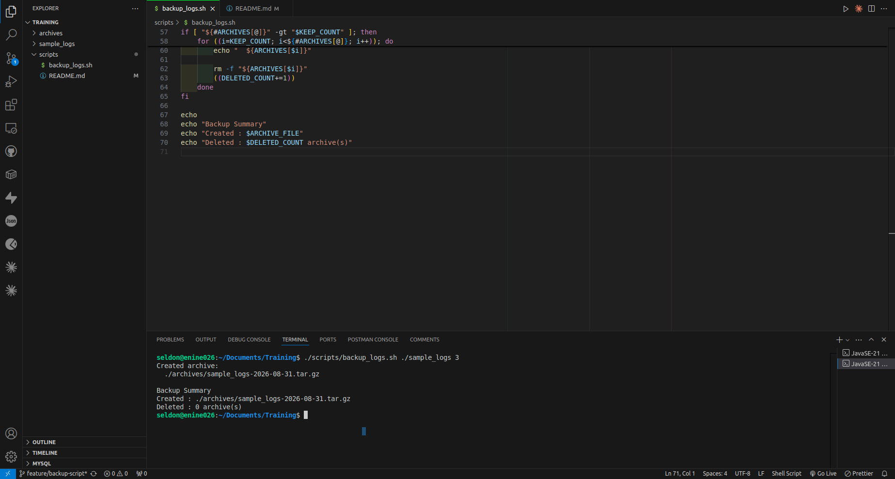

# Backup Logs Script
## Description

backup_logs.sh creates a compressed backup archive of a given directory and keeps only the latest N archives.

### Usage
./scripts/backup_logs.sh <source_directory> <keep_count>

### Example Output

