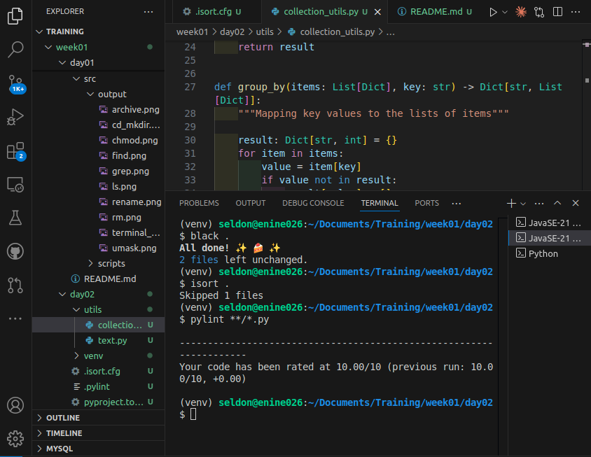

## Python Essentials And Local Quality Tools

# Format code with Black
 ```bash 
 black .
 ```
 
# Sort imports with isort
```bash
 isort .
 ```

# Run Pylint 
 ```bash 
 pylint **/*.py
 ```

### Terminal Output
