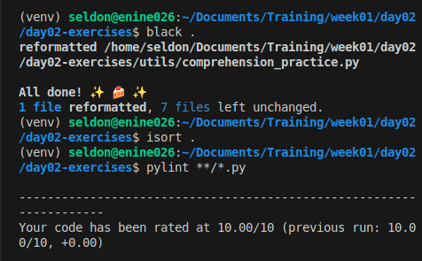
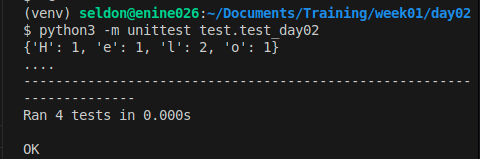

### LEGB
LEGB is nothing but the scope variables like local, enclosing, global, and B is built in . Local variable means they can only be used inside the functions where they are being declared, Global variable can be used anywhere inside that file , Enclosing variables are used in nested functions where the inner function can access that variable, and Built in functions are the functions that are already available and can be directly called anywhere in the code..
LEGB is nothing but the scope variables like Local, Enclosing, Global, and B is Built-in. Local variable means they can only be used inside the functions where they are being declared, Global variable can be used anywhere inside that file , Enclosing variables are used in nested functions where the inner function can access that variable, and Built-in  are the functions, exception, or constants that are already available and can be directly called anywhere in the code.

Example:

```bash
a="global scope"
def func1():
    b="enclosing scope"
    def func2():
        c="local scope"
        print("Built-in")
    func2()
func1()
```

### when to use list vs dict vs set
We use List when duplicates are fine, concerned about the order of elements, want mutability.
Set is being used when order doesn't matter, duplicates are not tolerated, want to perform set operations, fast searches.
Dictionary is being used when you need key value pairs, keys must be unique, access of values are faster because of the keys.

### Black, isort, pylint


### Unittest
