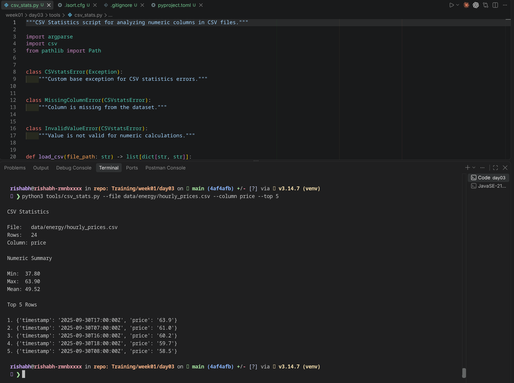
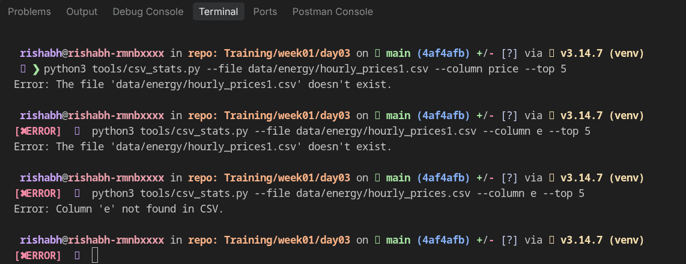

## CSV Stats
CLI script to read CSV data, extract valid numerical  columns, calculated column summary stats (mean, min, max), and returns the Top-N rows sorted in descending order.

## Setup Instructions

1. Clone the repository & navigate to the project root:

```Bash
cd Training/week01/day03
```
2. Activate your virtual environment (optional but recommended):

```Bash
python3 -m venv venv
source venv/bin/activate  # On Windows: venv\Scripts\activate
```
3. Install development dependencies (formatting & linting):

```Bash
pip install black isort pylint
```

### Usage

options:

  --file FILE&emsp;&emsp;&emsp;&emsp;&emsp;&emsp;   Path to the CSV file <br>
  --column COLUMN&nbsp;&nbsp;&nbsp;&nbsp;&nbsp;  Numeric column to analyze <br>
  --top TOP&emsp;&emsp;&emsp;&emsp;&emsp;&emsp;  Number of top rows to display <br>

```bash
python3 csv_stats.py --file FILE --column COLUMN --top TOP
```

Example:
```bash
python3 tools/csv_stats.py --file data/energy/hourly_prices.csv --column price --top 5
```
## Output


## Error Handling

