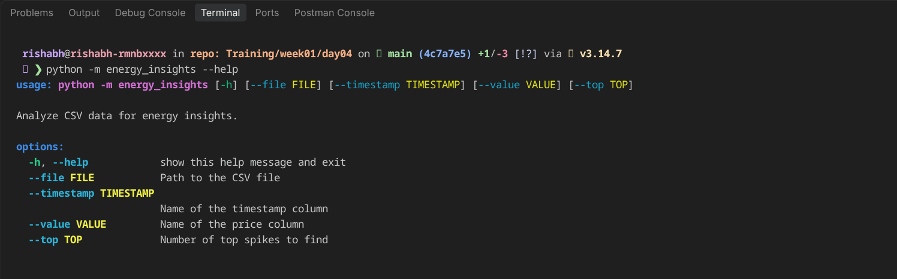
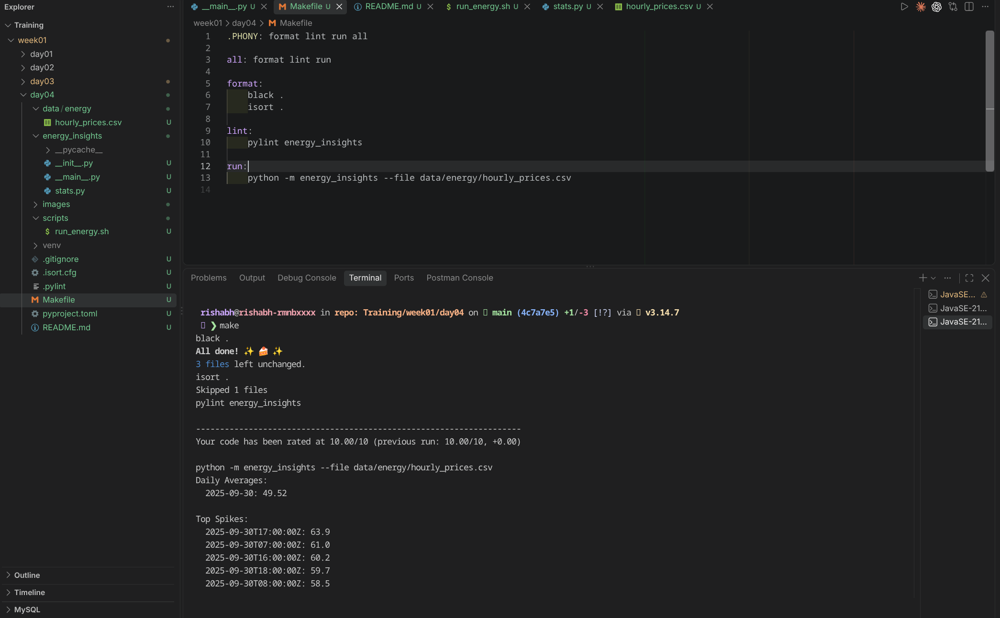

# Day 4: Shell Scripting and Python Packaging

A CSV energy-price analyzer as a Python module plus Makefile shortcuts.

## Run the CLI

View the available options:

```bash
python3 -m energy_insights --help
```

Analyze the supplied data:

```bash
python3 -m energy_insights --file data/energy/hourly_prices.csv
```


## Shell-script 
```bash
scripts/run_energy.sh --help
```
```bash
scripts/run_energy.sh data/energy/hourly_prices.csv
```

## Makefile shortcuts

```bash
make format  # Format code with Black and isort
make lint    # Run Pylint on the package
make run     # Analyze the included sample CSV
make all     # Format, lint, then run
```

### python -m energy_insights --help


### Makefile
