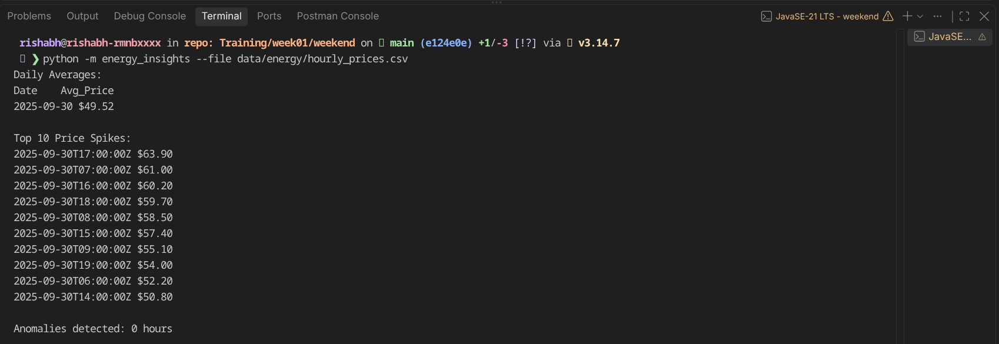
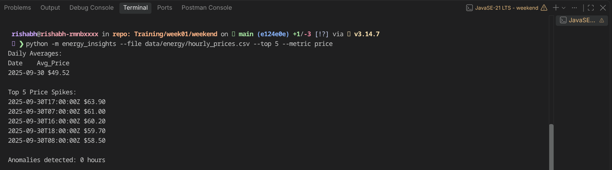
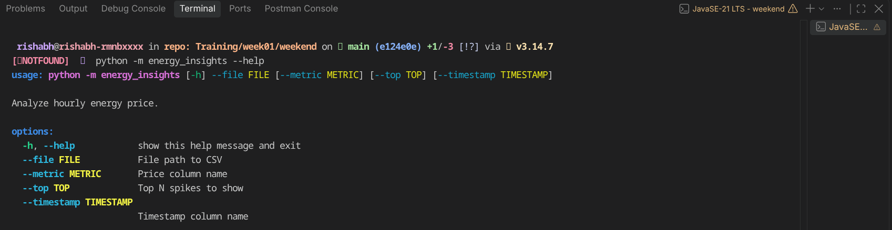
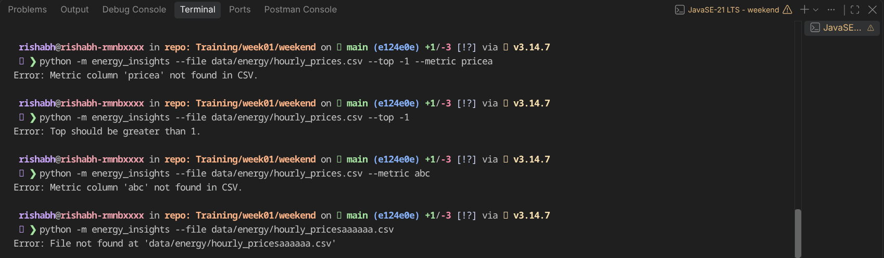
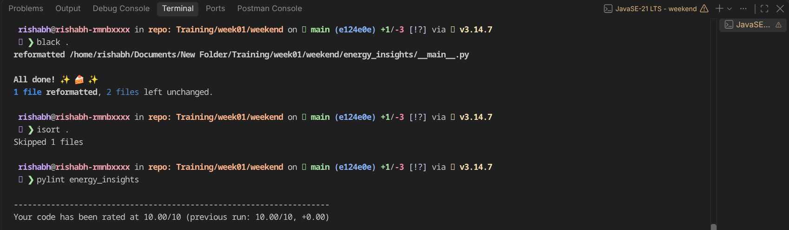

# Energy Insights CLI

`energy_insights` is a small command-line tool for analyzing hourly energy-price CSV data.

## Setup

From this directory, create and activate a virtual environment, then install the dependencies:

```bash
python -m venv .venv
source .venv/bin/activate
python -m pip install numpy scipy
```


## Usage

Run the package from the project directory:

```bash
python -m energy_insights --file data/energy/hourly_prices.csv
```




```bash
python -m energy_insights --file data/energy/hourly_prices.csv --top 5 --metric market_price
```


Use `--help` to see all options:

```bash
python -m energy_insights --help
```



## Error handling



## Code quality

With the virtual environment activated, run the project checks from this directory:

```bash
black .
isort .
pylint energy_insights
```
