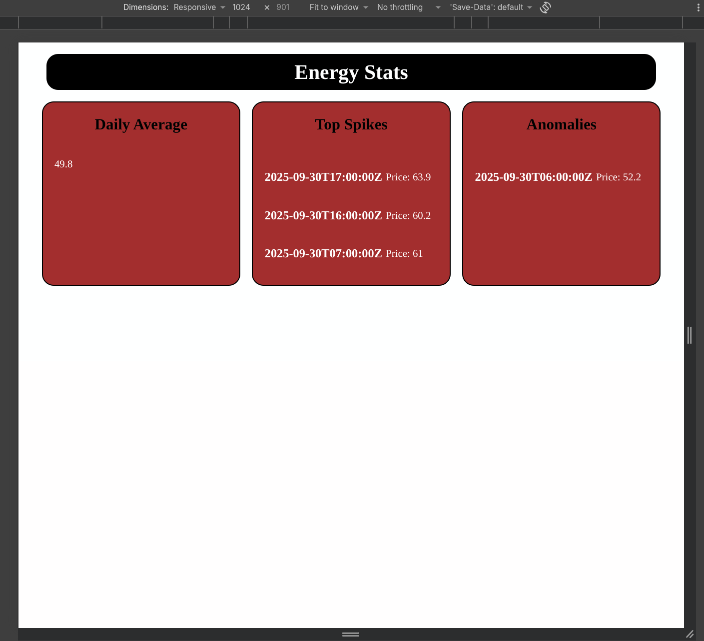
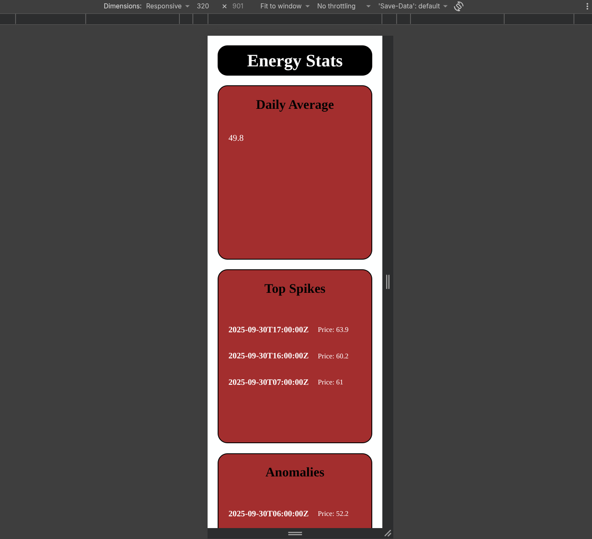
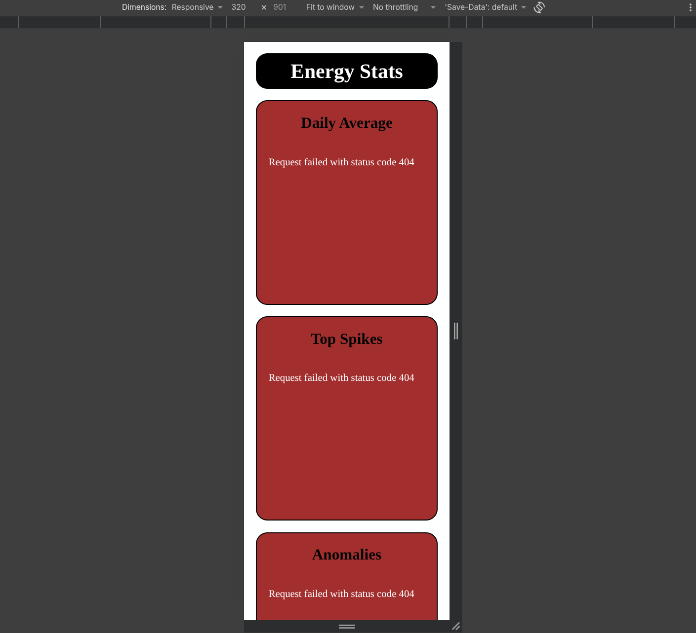

# Energy Stats Dashboard

A responsive, browser-based dashboard for displaying energy-price statistics from a local JSON file.

## Features

- Displays the daily average energy price.
- Renders cards for the highest price spikes.
- Lists detected pricing anomalies.
- Shows loading text initially and replaces it with an error message if the data cannot be loaded.
- Responsive for every screen layout.


## Run locally

Serve the files through a local web server; opening `index.html` directly may prevent the browser from fetching the JSON file.

```bash
cd src
python3 -m http.server
```


## Dependencies

Axios is imported in the browser from jsDelivr. The project also lists Axios in `package.json`; install it locally only if you need the package for further development:

```bash
npm install
```

## Screenshots


