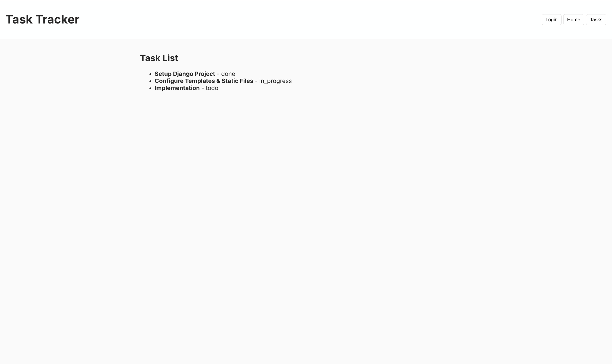

# Task Tracker

A small Django task-tracker exercise that introduces project/app structure,
template rendering, static assets, and URL routing.


## Run locally

From this directory, create and activate a virtual environment (optional but
recommended), install Django, then start the development server:

```bash
python -m venv .venv
source .venv/bin/activate
python -m pip install django
python manage.py migrate
python manage.py runserver
```


## Checks

Run Django's built-in configuration check with:

```bash
python manage.py check
```

## Screenshots

