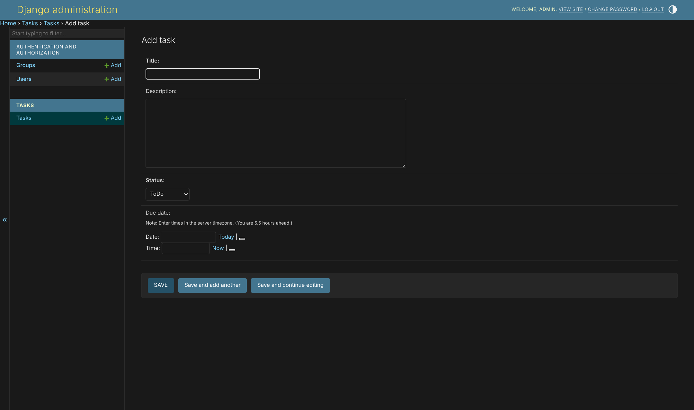
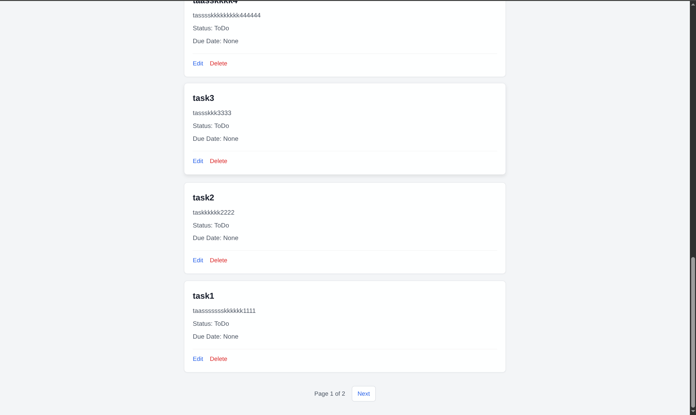
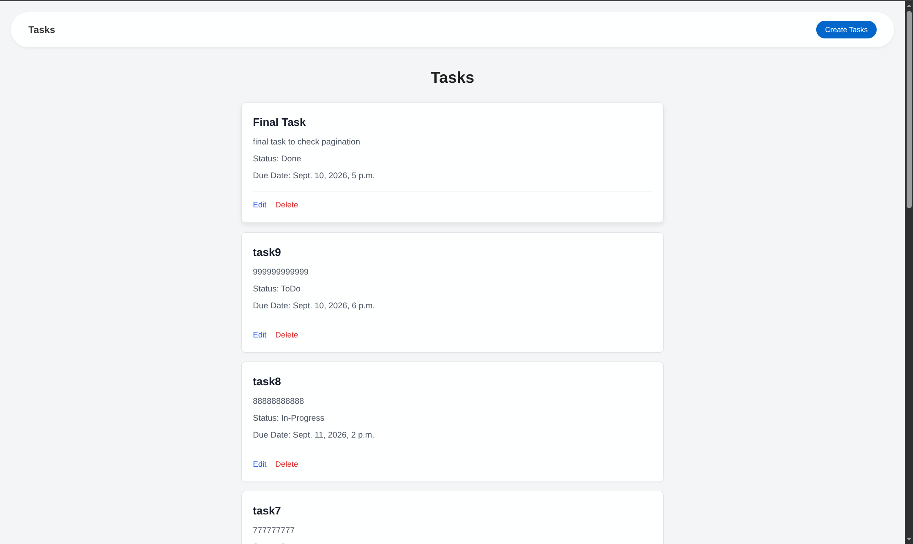
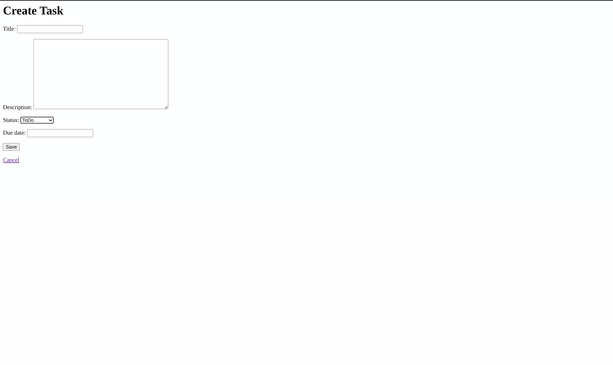
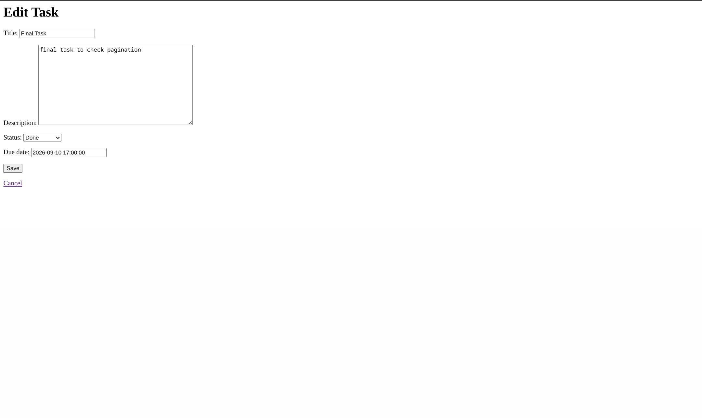
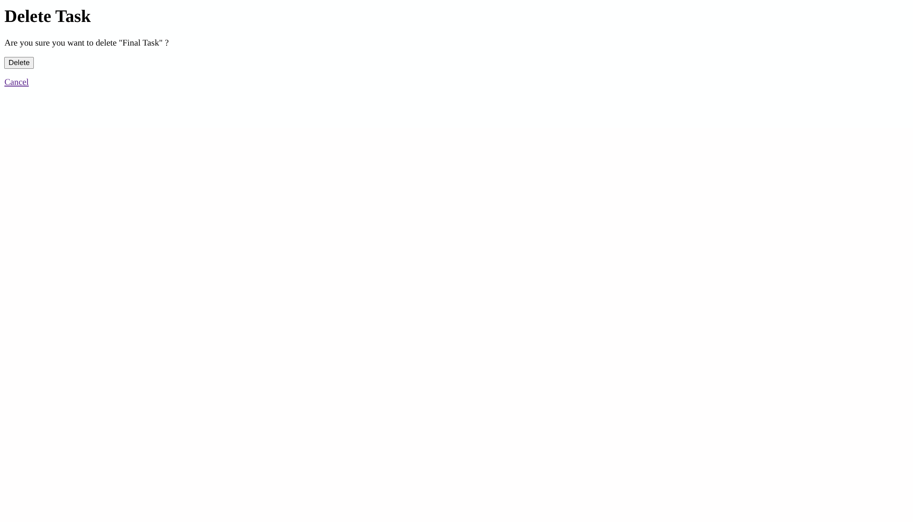

# Task Tracker

A simple Django task-management application. It lets you perform all CRUD operations.

## Getting started

From this directory, create and activate a virtual environment:

```bash
python -m venv .venv
source .venv/bin/activate
```

Install Django and apply the database migrations:

```bash
pip install django
python manage.py migrate
```

Start the development server:

```bash
python manage.py runserver
```

```bash
python manage.py createsuperuser
```
Route : "/admin/"


## Screenshots







