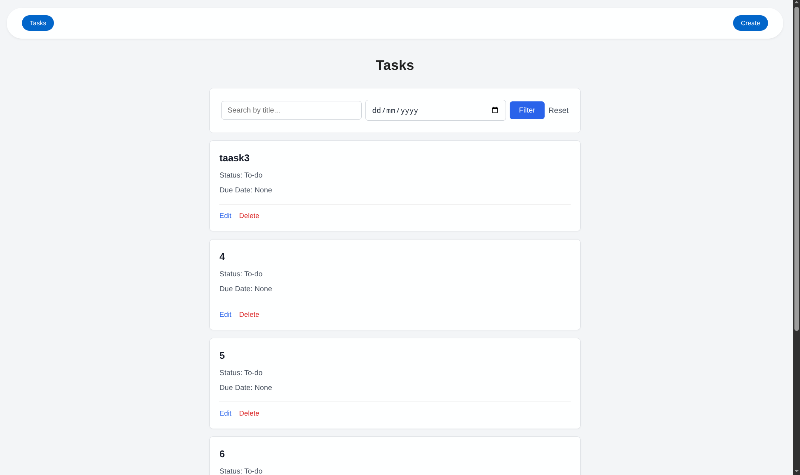
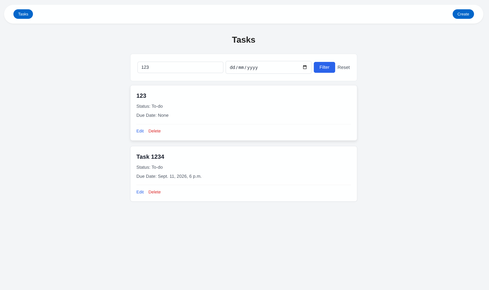
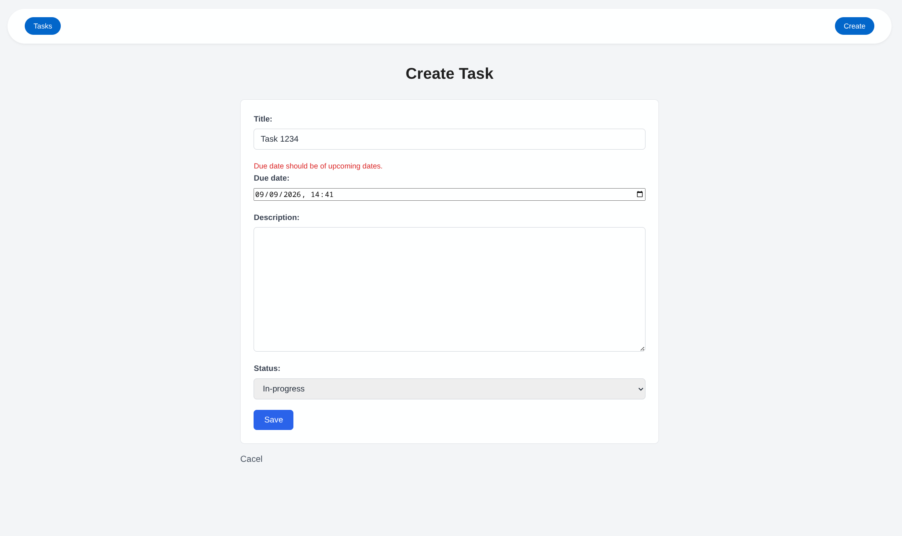

# Task Tracker

A simple task-management application built with Django. It lets users perform CRUD operations, search, and filter.

## Run locally

From this directory, create and activate a virtual environment (recommended), install Django, then apply migrations and start the server:

```bash
python -m venv .venv
source .venv/bin/activate
pip install django
python manage.py migrate
python manage.py runserver
```

## Usage

1. Select **Create** in the navigation bar.
2. Enter a title, optional description and due date, then choose a status.
3. Save the task.
4. Use **Edit** or **Delete** on a task card to manage it.
5. Use the title search to narrow the results.

## Screenshots

### Task list



### Filter task



### Validation


