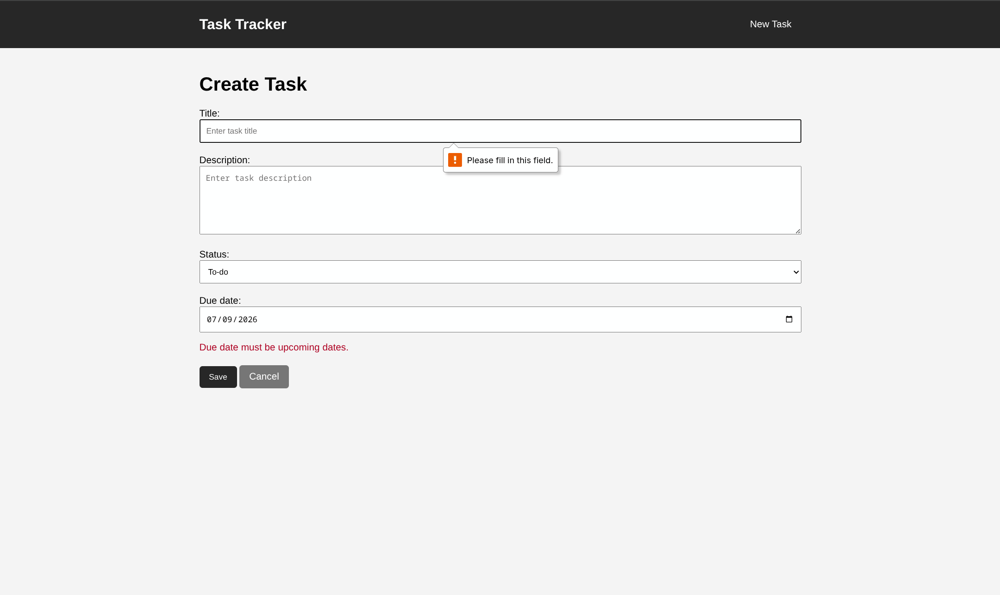
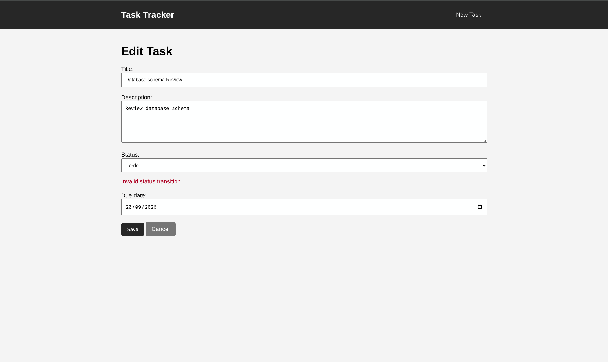
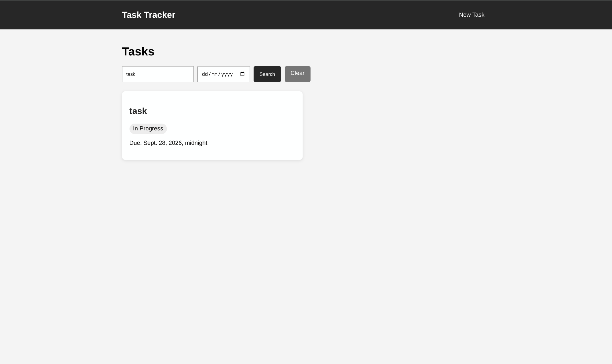

# Task Tracker

A small Django task-management application for creating, viewing, updating, searching, and deleting tasks.

## Features

- Create tasks with a title, optional description, status, and optional due date.
- Browse task details and edit or delete existing tasks.
- Search tasks by title and filter them by due-date.
- Paginate task lists (10 tasks per page).
- Validate task data:
  - New-task due dates must be an upcoming date.
  - Titles cannot be blank.
  - Status changes follow this flow: **To-do -> In Progress -> Done**. Completed tasks cannot be moved back.


## Getting started

From this directory, create and activate a virtual environment:

```bash
python3 -m venv venv
source venv/bin/activate
```

Install Django, apply database migrations, and start the development server:

```bash
pip3 install django
python3 manage.py makemigrations
python3 manage.py migrate
python3 manage.py runserver
```


## Demo data

Run the following command to create a demo administrator and 10 sample tasks:

```bash
python3 manage.py seed_data
```

## Screenshots

### Due-date validation



### Status-transition validation



### Search and filter


