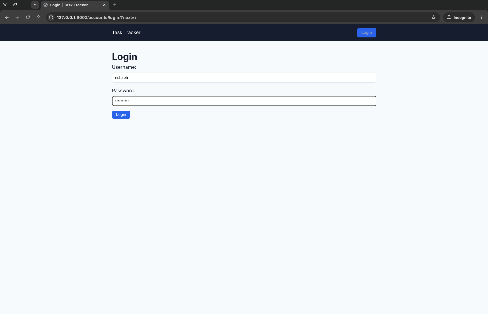
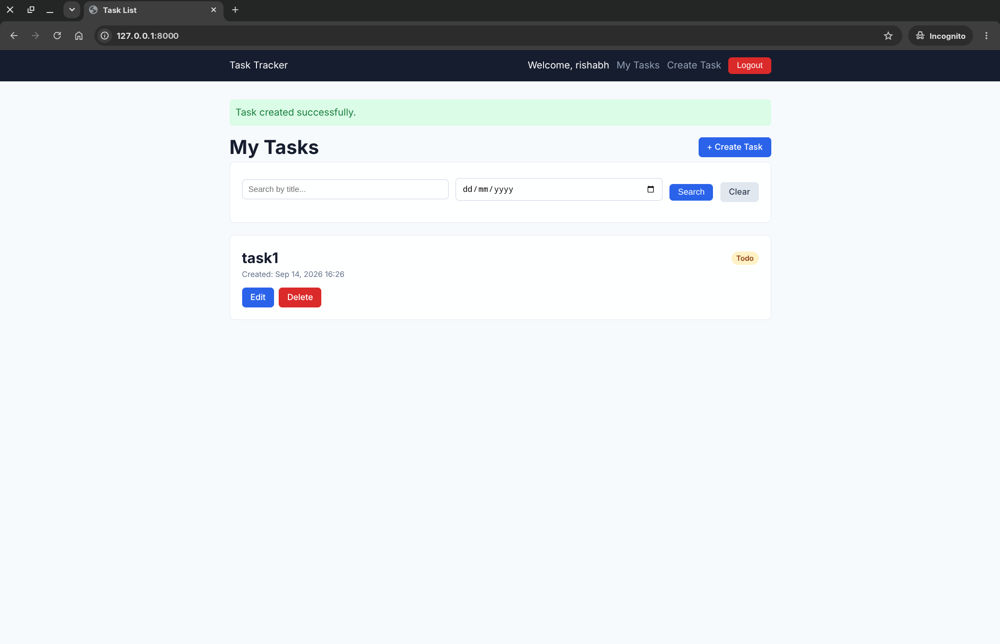

# Task Tracker (Auth)
A Django task tracker with login/logout.

## What this exercise adds

- Django's built-in authentication views at `/accounts/login/` and `/accounts/logout/`.
- A login page at `tasks/templates/registration/login.html`.
- An `owner` foreign key from each `Task` to Django's `User` model.
- Automatic ownership assignment when an authenticated user creates a task.
- User-scoped task list, edit, and delete queries: users can only access their own tasks.
- Success messages for create, update, and delete actions.

## Run locally

From this directory:

```bash
python3 manage.py makemigrations
python3 manage.py migrate
python3 manage.py createsuperuser
python3 manage.py runserver
```

The project configuration sets in `settings.py`:

```python
LOGIN_URL = "login"
LOGIN_REDIRECT_URL = "task-list"
LOGOUT_REDIRECT_URL = "login"
```


## Screenshots

