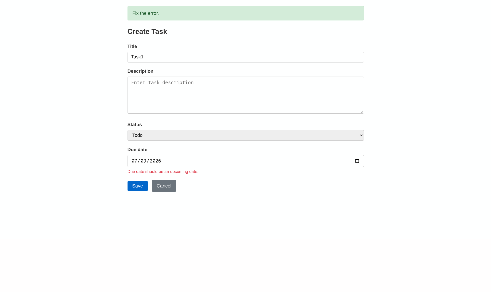
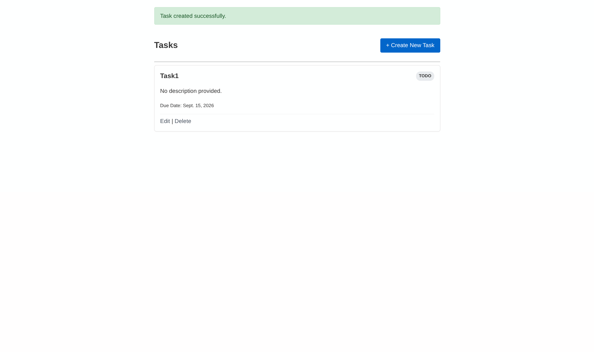
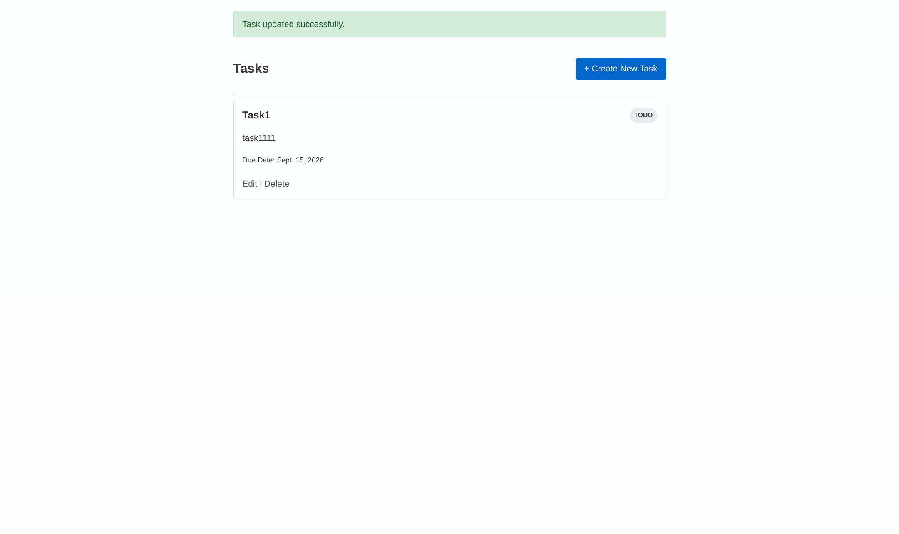
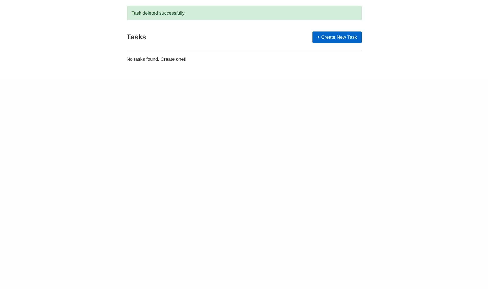

# Forms and Validation

A Django task tracker that uses a `ModelForm` to validate task data.

## Validation notes

`TaskForm` is based on the `Task` model and includes `title`, `description`, `status`, and `due_date`.

| Rule | Validation location | Error shown |
| --- | --- | --- |
| A title must contain at least 3 characters after trimming whitespace. | `clean_title()` | Field error for **Title** |
| A due date cannot be before today. | `clean_due_date()` | Field error for **Due date** |
| A task marked **Done** must have a due date. | `clean()` | Non-field/form-wide error |


## Messages

The shared base template renders Django messages at the top of the page.

- `Task created successfully.`
- `Task updated successfully.`
- `Task deleted successfully.`
- `Fix the error.` for invalid create or update attempts.

## Run locally

From this directory:

```bash
python3 -m venv venv
source venv/bin/activate
pip3 install django
python3 manage.py makemigrations
python3 manage.py migrate
python3 manage.py runserver
```


## Screenshots

### Invalid due date



### Successful create



### Successful update



### Successful delete




