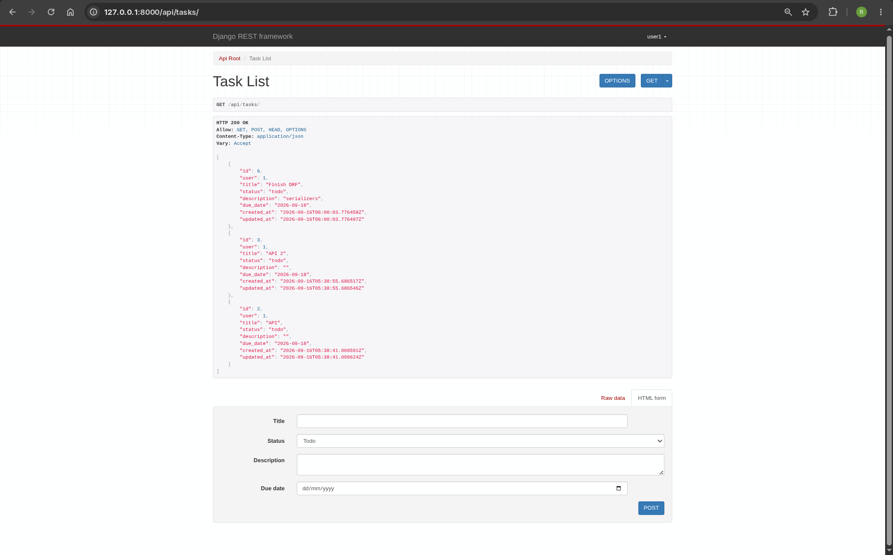
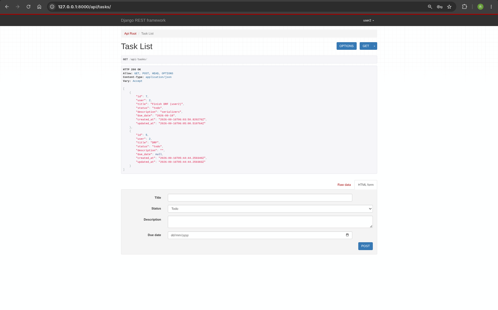
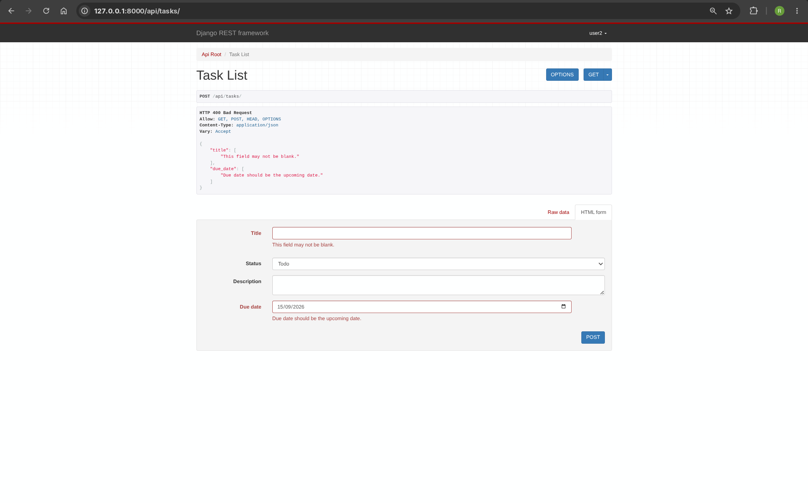

# Task Tracker REST API

A small Django REST Framework API for creating and managing tasks. Every task belongs to a user, and authenticated users can only list, create, retrieve, update, or delete their own tasks.

## Setup

From this directory, create and activate a virtual environment, install the dependencies, and run the migrations:

```bash
python3 -m venv venv
source venv/bin/activate
pip3 install -r requirements.txt
python3 manage.py makemigrations
python3 manage.py migrate
python3 manage.py runserver
```


Create a user for testing:

```bash
python manage.py createsuperuser
```

## Authentication
To obtain a token, send a username and password to `POST /api-token-auth/`:

```bash
curl -X POST http://127.0.0.1:8000/api-token-auth/ \
  -H 'Content-Type: application/json' \
  -d '{"username":"your_username","password":"your_password"}'
```


## Task fields and validation

| Field | Type | Notes |
| --- | --- | --- |
| `id` | integer | Read-only |
| `user` | integer | Read-only; assigned from the authenticated user |
| `title` | string | Required and cannot be empty or only whitespace |
| `description` | string | Optional |
| `status` | string | One of `todo`, `in-progress`, or `done`; defaults to `todo` |
| `due_date` | date | Optional, format (`YYYY-MM-DD`), and must be after today |
| `created_at` / `updated_at` | datetime | Read-only |

## Example Requests

Create a task:

```bash
curl -X POST http://127.0.0.1:8000/api/tasks/ \
  -H 'Authorization: Token <token>' \
  -H 'Content-Type: application/json' \
  -d '{
    "title": "Learn DRF ",
    "description": "Learn DRF and implement.",
    "status": "in-progress",
    "due_date": "2026-09-17"
  }'
```

Partially update its status:

```bash
curl -X PATCH http://127.0.0.1:8000/api/tasks/1/ \
  -H 'Authorization: Token <token>' \
  -H 'Content-Type: application/json' \
  -d '{"status":"done"}'
```

Delete it:

```bash
curl -X DELETE http://127.0.0.1:8000/api/tasks/1/ \
  -H 'Authorization: Token <token>'
```
## Screenshots


