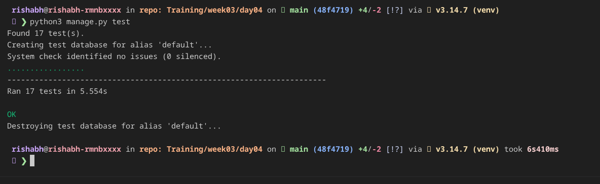

# Testing Basics

Unit tests for models, forms, views, and API endpoints.

## Setup

```bash
python3 -m venv venv
source venv/bin/activate
pip3 install -r requirements.txt
python3 manage.py makemigrations
python3 manage.py migrate
```

## Run tests

Run the complete test:

```bash
python3 manage.py test
```



## Test coverage

| Area | Test file | What it verifies |
| --- | --- | --- |
| Task model | `tasks/tests/test_models.py` | Creation, default status, string representation, and invalid past due dates |
| TaskForm | `tasks/tests/test_forms.py` | Required titles, whitespace-only titles, and valid form data |
| TaskViewSet | `tasks/tests/test_views.py` | Login protection and rendering a signed-in user's task |
| REST API | `tasks/tests/test_api.py` | Authentication, per-user task lists, create success/failure cases, due-date validation, ownership, and deletion |


