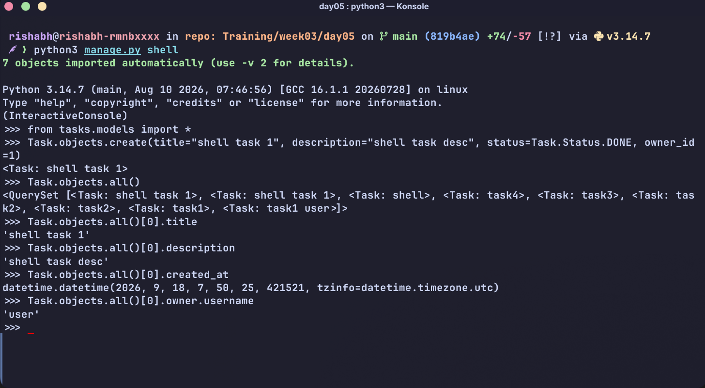
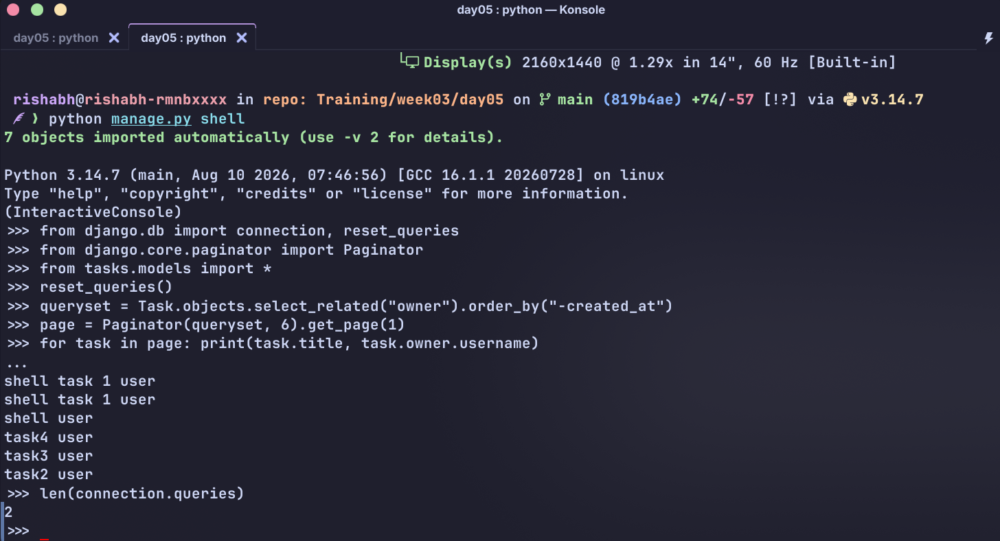
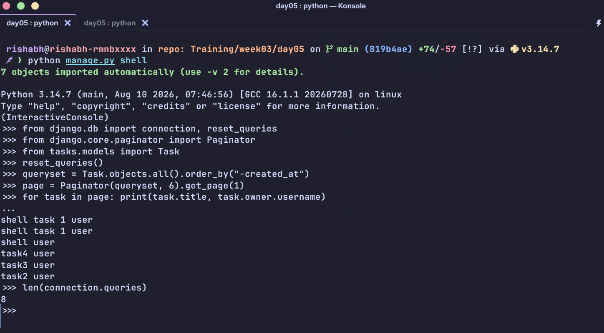
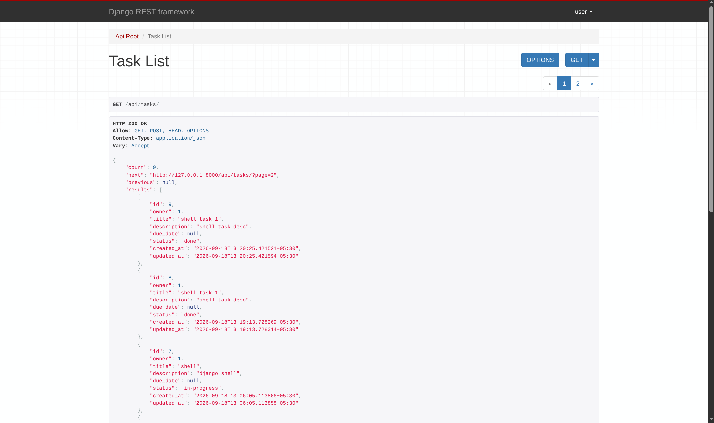
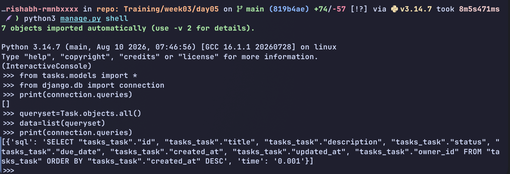

# Pagination and Simple Performance

Pagination and basic query optimization patterns.

## Run locally

```bash
python3 -m venv .venv
source .venv/bin/activate
pip install -r requirements.txt
python3 manage.py makemigrations
python3 manage.py migrate
python3 manage.py createsuperuser
python3 manage.py runserver
```
## Pagination

| Interface | Endpoint | Default page size | Controls |
| --- | --- | ---: | --- |
| Web task list | `/` | 6 tasks | `?page=2` |
| REST API | `/api/tasks/` | 6 tasks | `?page=2`, `?page_size=12` |

The web list uses Django's `ListView` pagination (`paginate_by = 6`). It displays the current range, total number of tasks, and first/previous/next/last links. The API uses a custom DRF `PageNumberPagination` class. API callers can choose a page size with `page_size`, capped at 50, so a request such as `/api/tasks/?page=2&page_size=12` returns at most 12 records.


## Query review

The web `TaskListView` and API `TaskViewSet` build their task queryset as follows:

```python
Task.objects.filter(owner=request.user).select_related("owner").order_by("-created_at")
```

`select_related("owner")` joins the single-valued `owner` foreign key into the task query. It avoids an N+1 pattern if owner data is accessed while rendering or serializing each task. 

### Observed query pattern


To inspect this in the Django shell:

```bash
python manage.py shell
```

```python
from django.db import connection, reset_queries
from django.core.paginator import Paginator
from tasks.models import Task

reset_queries()

queryset = Task.objects.select_related("owner").order_by("-created_at")
# For N+1 replace .select_related with .all()
# queryset = Task.objects.all().order_by("-created_at")

page = Paginator(queryset, 6).get_page(1)
for task in page: print(task.title, task.owner.username)
len(connection.queries)
connection.queries
```

## Screenshots


### Optimized



### N+1





