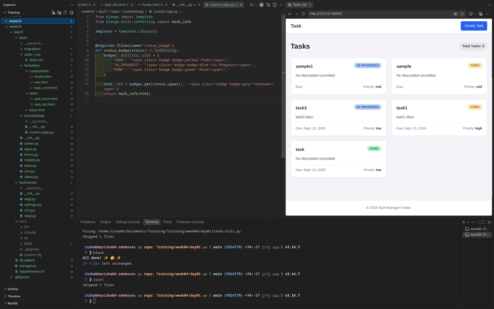

# Templates Deep Dive

A small Django task manager built to practise template inheritance, reusable partials, built-in filters, and a custom template filter.



## What it demonstrates

- A shared `base.html` layout with `title` and `content` blocks, plus a global Django messages area.
- Reusable `nav.html`, `footer.html`, and `task_card.html` partials included across pages.
- A custom `status_badge` filter that turns a task status into a styled status badge.


## Run locally

From this directory:

```bash
python3 -m venv .venv
source .venv/bin/activate
pip3 install -r requirements.txt
python3 manage.py makemigrationss
python3 manage.py migrate
python3 manage.py runserver
```

## Template notes

`tasks/task_list.html` and `tasks/task_form.html` extend `base.html`. The base layout loads the `style.css`, includes the navigation and footer.

The task list delegates each individual task to `components/task_card.html`:

```django

```

The card uses these built-in filters such as `truncatechars`, `safe`, `date`.

## Custom `status_badge` filter

The `status_badge` filter in `tasks/templatetags/custom_tags.py` maps `todo`, `in_progress`, and `done` to a badge label and CSS class. It is loaded in the task-card partial.

The filter returns marked-safe HTML so the badge markup is rendered.
